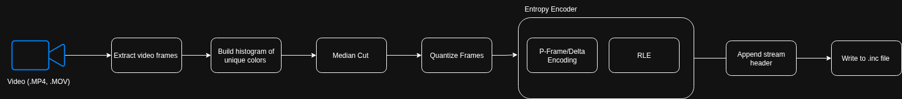
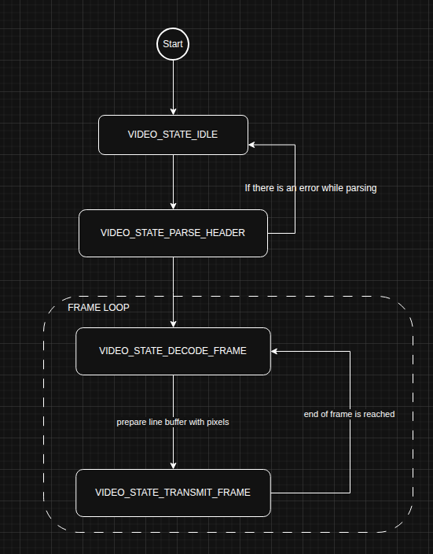

# Software Documentation

This document describes the software architecture for the host-side python script which compress video files
into a C-array format and the MCU decoder which parses the encoded array and displays the video frames to an LCD screen.

# Codec 

The python codec performs the following operations on a .mp4 video 

1. First, user inputs desired video file and selects codec options
2. Then, the video frames are extracted from the mp4 file into a numpy array using OpenCV
3. After, histogram with list of all unique colors present in video is created 
4. Next, color palette (1-256 colors) table that will represent all new colors in the video is generated. 
5. Then, each frame gets quantized by mapping each pixel to the closest index in the table by determining the shortest euclidean distance to the nearest color on the RGB cube.
6. Delta compression and run-length encoding methods are used to pack pixels. Both of these methods were chosen for being lossless, easy to implement on a microcontroller, and require little in terms of computation to decode. 
7. Lastly, a byte stream is prepared which includes the video metadata, followed by the palette table, and finally the compressed video data. The video data is written to a .inc file which is included in the contents of `video_stream` array defined in `video.c`

The MCU decoder logic simply inverses the following pipeline, parsing the video header, palette table, and undoes the delta encoding and RLE steps to get back the original frame. Since the ST7735 only support 12, 16, or 18 bit RGB, the decoder uses truncate the original 24 bit RGB value to RGB565 before storing the pixel to the DMA buffer.

# Finite State Machine 

The video player uses a 4-state finite state machine structure for managing video header parsing, decoding frames, and transmitting pixel data to the LCD screen through DMA-driven SPI transfer. For a 128x128 LCD screen, a DMA buffer of size 1024 is used to send 512 pixels or 4 scanlines at a time. For now, the entire frame is transmitted before decoding the next frame.

At the moment, the video player perpetually loops the video and does not return to the IDLE state after the video ends. In the future, button inputs will be added to allow the user to stop/start the video or move to different frames in the video.

# Limitations and Future Improvements
- Python codec should stream frames rather than storing all video frames in main to reduce memory overhead. 
- K-d trees can replaced euclidean distance matching (which has O(N*K) time complexity) to speed up quantization time.
- Switching to the YUV color space tends to lead to more efficient data compression as the human eye is more sensitive to brightness instead of color. 
- Employ 1 or 2-byte vertical replication packets described in https://www.fileformat.info/mirror/egff/ch09_03.htm to improve RLE efficiency
- Look into using huffman encoding or Discrete Cosine Transforms (DCT) to achieve higher compression ratios.
- The Median cut algorithm can be replaced with a non-recursive implementation (https://jacobfilipp.com/DrDobbs/articles/DDJ/1994/9409/9409e/9409e.htm#00da_0053) to reduce stack calls and eliminate issues addressed with cube splitting.
- Other quantization methods can be explored that were designed for video. From my understanding, Median cut was mainly designed for single images. Quantizing N pixels across videos with higher resolution and run times does not seem to efficient as millions/billions of pixels may exist in one video.
- Implement DMA double buffering to increase throughput and FPS.

RLE and delta compression work best with little motion and uniform colors since pixels tend to be repeated both spatially and temporally. Obviously for very dynamic videos with a lot of action, achieving good compression with these methods are not really feasible and more sophisticated methods would need to be applied like motion vector estimation. However, higer compression ratios comes at higher cost to the CPU's resources which may not be possible in memory-constrained microcontrollers like the MSP432. With that in mind, the overall philosophy of this project was to build a software video codec that could run on microcontrollers with limited RAM/Flash and play video only using the MCU's internal flash memory and no external SD card like in many projects 